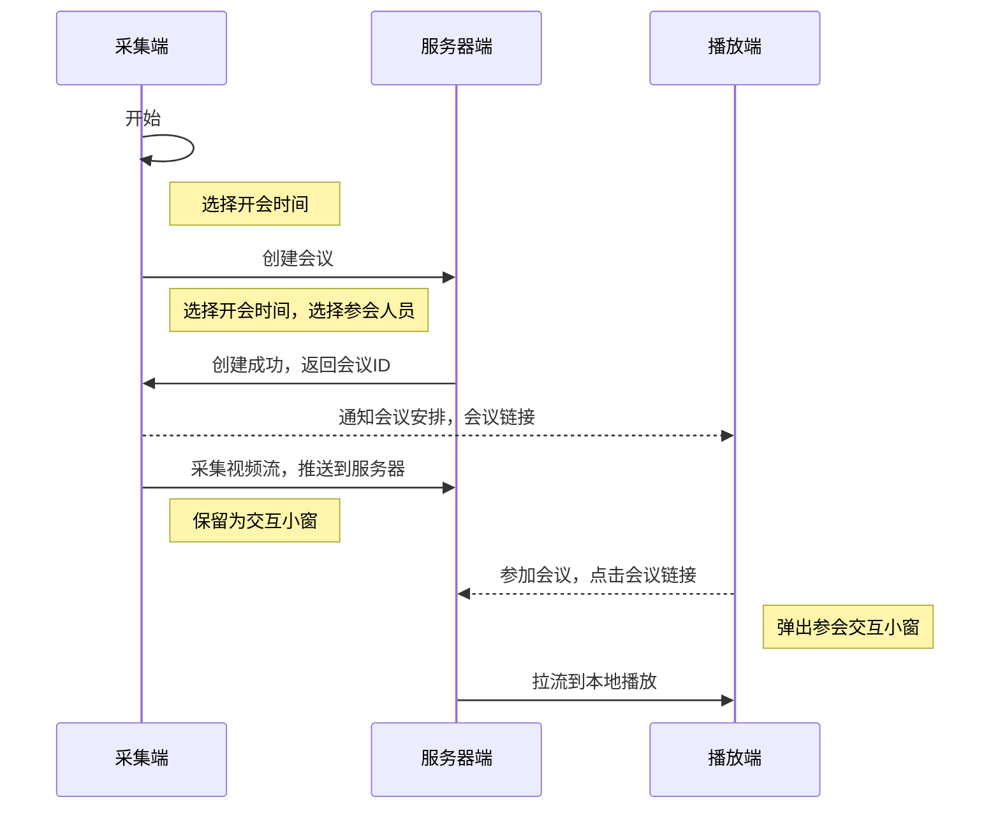


> 基本框图

## **基本角色**
 1. 采集端
 2. 服务器端
 3. 播放端

## 顺序图

```mermaid
sequenceDiagram
采集端 ->> 采集端: 开始
Note right of 采集端: 选择开会时间
采集端 ->> 服务器端: 创建会议
Note right of 采集端: 选择开会时间，选择参会人员
服务器端 ->> 采集端: 创建成功，返回会议ID
采集端 -->> 播放端: 通知会议安排，会议链接
采集端 ->> 服务器端: 采集视频流，推送到服务器
Note right of 采集端: 保留为交互小窗
播放端 -->> 服务器端: 参加会议，点击会议链接
Note right of 播放端: 弹出参会交互小窗
服务器端 ->> 播放端: 拉流到本地播放

```

